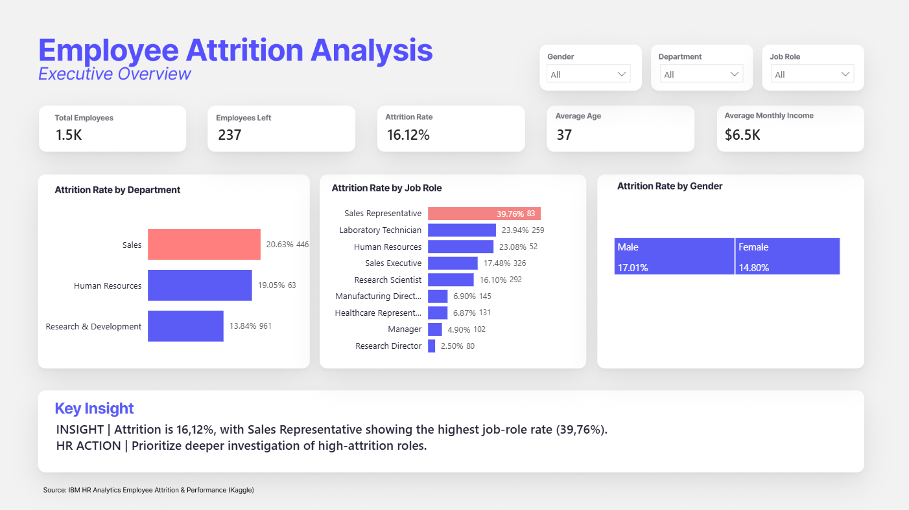

# HR Analytics | Análise de Attrition de Colaboradores

[🇺🇸 English](README.md) | 🇧🇷 **Português**

**Power BI • Power Query • DAX • People Analytics • Data Visualization • Data Storytelling**

📊 **Dashboard:** [Baixe o arquivo .pbix para explorar o relatório interativo no Power BI Desktop.](dashboard/PeopleAnalyticsEmployeeAttrition.pbix)

> Um estudo de caso de People Analytics desenvolvido no Power BI para
> explorar padrões de desligamento, identificar grupos de colaboradores
> com maiores taxas de attrition e transformar dados em perguntas e
> oportunidades de investigação para RH.

## Visão Geral do Projeto

O desligamento de colaboradores pode impactar o conhecimento
organizacional, a produtividade, o planejamento da força de trabalho, os
custos de recrutamento e a estabilidade das equipes. Este projeto foi
desenvolvido como um case de portfólio em People Analytics para
investigar **quem está saindo, quais características do trabalho estão
associadas a maiores taxas de attrition e onde o RH pode priorizar
análises mais aprofundadas**.

A análise é descritiva e exploratória. Ela identifica associações
presentes no conjunto de dados, mas **não afirma que um fator isolado
seja a causa do desligamento**.

### Principais objetivos

-   Mensurar a taxa geral de attrition.
-   Identificar departamentos e cargos com maiores taxas de
    desligamento.
-   Explorar padrões relacionados ao perfil e ao tempo de empresa dos
    colaboradores.
-   Analisar fatores como horas extras, equilíbrio entre vida pessoal e
    trabalho, satisfação com o ambiente, envolvimento com o trabalho,
    viagens corporativas, distância de casa e treinamentos.
-   Construir um dashboard interativo no Power BI com filtros e insights
    narrativos dinâmicos.
-   Traduzir os resultados analíticos em possíveis frentes de
    investigação para RH.

## Perguntas de Negócio

1.  Qual é a taxa geral de attrition?
2.  Quais departamentos e cargos apresentam as maiores taxas?
3.  A realização de horas extras está associada a maior attrition?
4.  Em qual momento da jornada do colaborador a taxa de desligamento é
    maior?
5.  Quais faixas etárias apresentam maior attrition?
6.  Como Work-Life Balance e satisfação com o ambiente se relacionam com
    attrition?
7.  Como o nível de envolvimento com o trabalho varia em relação à taxa
    de desligamento?
8.  A frequência de viagens corporativas está associada a diferentes
    taxas de attrition?
9.  A distância entre casa e trabalho apresenta algum padrão relevante?
10. O que pode ser observado sobre frequência de treinamentos e
    attrition?

## Base de Dados

**Dataset:** IBM HR Analytics Employee Attrition & Performance\
**Fonte:** Kaggle\
**Página do dataset:**
https://www.kaggle.com/datasets/pavansubhasht/ibm-hr-analytics-attrition-dataset\
**Criador original:** cientistas de dados da IBM\
**Natureza:** base fictícia / sintética de RH\
**Tamanho original:** 1.470 registros de colaboradores e 35 variáveis

A base contém informações demográficas, características dos cargos,
remuneração, indicadores de satisfação, condições de trabalho,
experiência profissional, treinamentos, tempo de empresa e a variável
`Attrition`, que indica se o colaborador deixou a empresa.

> Como o conjunto de dados é fictício, os resultados devem ser
> interpretados como um estudo de caso de portfólio, e não como
> conclusões sobre uma organização real.

## Preparação dos Dados

A preparação dos dados foi realizada no **Power Query** antes da
construção do modelo analítico.

### Validação da qualidade dos dados

-   Confirmação de **1.470 registros de colaboradores**.
-   Utilização de `EmployeeNumber` como identificador único.
-   Validação da variável `Attrition`:
    -   `No`: 1.233 colaboradores
    -   `Yes`: 237 colaboradores
-   Análise da qualidade, distribuição, tipos de dados, valores nulos e
    erros das colunas.
-   Validação dos intervalos das variáveis numéricas e das escalas
    categóricas antes da análise.

### Colunas removidas da visão analítica

Os seguintes campos foram removidos por serem constantes em todos os
registros ou por não agregarem valor às análises selecionadas:

-   `EmployeeCount`
-   `Over18`
-   `StandardHours`
-   `DailyRate`
-   `HourlyRate`
-   `MonthlyRate`

### Novos agrupamentos analíticos

Para melhorar a leitura e reduzir comparações excessivamente
fragmentadas, foram criados novos agrupamentos:

**Faixa Etária** - 18--25 - 26--35 - 36--45 - 46--55 - 56+

**Tempo de Empresa** - 0--1 ano - 2--3 anos - 4--5 anos - 6--10 anos -
11+ anos

**Distância de Casa** - 1--5 - 6--10 - 11--20 - 21--29

## Modelagem de Dados e DAX

Foram criadas medidas principais em DAX para que KPIs, gráficos e
insights narrativos respondessem dinamicamente aos filtros do relatório.

``` dax
Total Employees =
DISTINCTCOUNT('Planilha1'[EmployeeNumber])
```

``` dax
Employees_Left =
CALCULATE(
    [Total Employees],
    'Planilha1'[Attrition] = "Yes"
)
```

``` dax
Attrition_Rate =
DIVIDE(
    [Employees_Left],
    [Total Employees],
    0
)
```

Também foram desenvolvidas medidas para idade média, renda mensal média
e **insights narrativos dinâmicos**, que são recalculados conforme o
usuário filtra o relatório por gênero, departamento ou cargo.

## Estrutura do Dashboard

O relatório possui três páginas analíticas.

### 1. Executive Overview

**Objetivo:** apresentar uma visão executiva do cenário de attrition e
identificar onde os desligamentos estão mais concentrados.



Principais componentes: - Total de colaboradores - Colaboradores
desligados - Attrition Rate - Idade média - Renda mensal média -
Attrition Rate por departamento - Attrition Rate por cargo - Attrition
Rate por gênero - Key Insight dinâmico

**Principal resultado:** a taxa geral de attrition é de **16,12% (237
colaboradores)**. Sales apresenta a maior taxa entre os departamentos,
com **20,63%**, enquanto **Sales Representative** possui a maior taxa
entre os cargos, com **39,76%**.

### 2. Attrition Drivers

**Objetivo:** explorar características dos colaboradores e condições de
trabalho associadas a maiores taxas de attrition.


Análises: - Tempo de empresa - Faixa etária - Horas extras - Work-Life
Balance - Satisfação com o ambiente

Principais resultados: - Colaboradores com **0--1 ano de empresa:**
**34,88%** - Colaboradores de **18--25 anos:** **35,77%** - Overtime =
Yes: **30,53%** - Overtime = No: **10,44%** - Work-Life Balance nível 1:
**31,25%** - Environment Satisfaction nível 1: **25,35%**

Uma análise exploratória adicional mostrou que **71,5% dos colaboradores
de 18--25 anos possuem até três anos de empresa**. Isso indica uma
sobreposição entre idade e tempo de empresa, portanto essas variáveis
não devem ser automaticamente interpretadas como fatores independentes.

### 3. Work Experience & Development


**Objetivo:** explorar como experiência de trabalho, envolvimento,
viagens, distância e desenvolvimento se relacionam com attrition.

Análises: - Frequência de treinamentos - Job Involvement - Business
Travel - Distância de casa

Principais resultados: - Job Involvement nível 1: **33,73%** - Job
Involvement nível 4: **9,03%** - Viagens frequentes: **24,91%** - Sem
viagens: **8,00%** - Distância 1--5: **13,77%** - Distância 21--29:
aproximadamente **22%** - Nenhum treinamento no último ano: **27,78%**

A frequência de treinamentos **não apresenta uma relação linear
consistente** com attrition. Colaboradores sem treinamentos possuem a
maior taxa relacionada a essa dimensão, porém os percentuais oscilam
entre as demais frequências. Portanto, os dados não sustentam a
conclusão de que simplesmente aumentar a quantidade de treinamentos
reduziria o attrition.

## Principais Insights

### 1. O attrition está concentrado em grupos específicos

A taxa geral de attrition é de **16,12%**, mas existe uma variação
relevante entre os cargos. Sales Representative apresenta **39,76%**,
sendo o cargo de maior destaque na análise.

### 2. Horas extras apresentam forte associação com attrition

Colaboradores que realizam horas extras apresentam taxa de attrition de
**30,53%**, contra **10,44%** entre aqueles que não realizam.

Esse é um dos maiores contrastes encontrados no dashboard e sugere que
carga de trabalho e dinâmica de jornada merecem investigação mais
aprofundada.

### 3. O início da jornada do colaborador é um período crítico para retenção

Colaboradores com **0--1 ano de empresa** apresentam **34,88% de
attrition**, enquanto aqueles com 11+ anos apresentam **8,13%**.

Esse resultado sugere que onboarding, alinhamento de expectativas,
suporte da liderança e experiência durante o primeiro ano podem ser
frentes relevantes de investigação para RH.

### 4. Colaboradores mais jovens apresentam maior attrition, mas idade e tempo de empresa se sobrepõem

A faixa de **18--25 anos** apresenta taxa de **35,77%**. Entretanto,
71,5% desse grupo possui até três anos de empresa.

Essa sobreposição significa que o dashboard não deve ser utilizado para
concluir que a idade, isoladamente, seja responsável pelo desligamento.

### 5. Indicadores da experiência de trabalho apresentam diferenças relevantes

Baixo Job Involvement está associado a uma taxa de attrition
significativamente maior (**33,73%**) do que alto Job Involvement
(**9,03%**).

Colaboradores que viajam frequentemente também apresentam maior
attrition (**24,91%**) do que aqueles que não viajam (**8,00%**).

Na análise agrupada de distância, colaboradores que moram mais longe
apresentam taxas maiores, chegando a aproximadamente **22%** na faixa de
21--29.

### 6. Treinamento exige uma interpretação mais cuidadosa

Colaboradores sem treinamento no último ano apresentam **27,78% de
attrition**, mas a frequência de treinamentos e a taxa de desligamento
não seguem um padrão linear.

O resultado indica a necessidade de investigar acesso, relevância,
qualidade, perfil dos participantes e oportunidades de desenvolvimento,
em vez de concluir que "mais treinamentos = menor attrition".

## Dos Dados para Ações de RH

O objetivo do dashboard é orientar **perguntas, priorização e
investigações**, e não prescrever ações com base apenas em correlações.

Possíveis frentes para RH:

-   **Retenção no início da jornada:** revisar onboarding, checkpoints
    do primeiro ano, alinhamento de expectativas e suporte da liderança.
-   **Experiência de Sales Representatives:** investigar carga de
    trabalho, metas, expectativas do cargo, práticas de liderança,
    estrutura de remuneração e possibilidades de carreira.
-   **Horas extras:** analisar frequência, distribuição da carga de
    trabalho, capacidade das equipes e concentração de overtime por área
    ou cargo.
-   **Job Involvement:** complementar a análise com pesquisas pulse,
    escuta de colaboradores, conversas com gestores e análises
    qualitativas.
-   **Viagens corporativas:** investigar intensidade das viagens, tempo
    de recuperação, flexibilidade e experiência dos colaboradores que
    viajam frequentemente.
-   **Distância de casa:** avaliar se flexibilidade, trabalho híbrido,
    transporte ou práticas específicas por localidade podem influenciar
    a experiência.
-   **Treinamento:** avaliar acesso, qualidade, relevância, conclusão e
    aplicação do aprendizado, e não apenas quantidade de treinamentos.

## Decisões Analíticas e Análises Exploratórias

Nem toda análise exploratória realizada durante o projeto foi incluída
no dashboard final.

Por exemplo, inicialmente os colaboradores que saíram apresentavam renda
mensal média inferior à daqueles que permaneceram. Porém, ao realizar a
comparação dentro do mesmo cargo --- Sales Representative --- a
diferença salarial diminuiu de forma relevante.

Isso indicou que a **composição dos cargos poderia explicar parte da
diferença geral de renda**, portanto remuneração não foi apresentada
como um driver isolado de attrition no dashboard final.

Da mesma forma, variáveis como `YearsSinceLastPromotion` não foram
priorizadas, pois idade e tempo de empresa poderiam influenciar
fortemente sua interpretação.

## Limitações

-   A base é **fictícia**, e não composta por dados produtivos de uma
    organização real.
-   A análise é descritiva e observacional: **associação não implica
    causalidade**.
-   Não existe uma dimensão histórica adequada para analisar tendências
    de attrition ao longo de meses ou anos.
-   A base não fornece motivos detalhados para os desligamentos.
-   Idade, tempo de empresa, cargo, renda e outras variáveis podem estar
    correlacionadas entre si.
-   Uma análise estatística multivariada seria necessária para estimar a
    contribuição independente de cada fator.
-   O dashboard deve ser utilizado para identificar **áreas que merecem
    investigação**, e não para realizar previsões determinísticas sobre
    colaboradores individuais.

## Ferramentas e Competências

-   **Power BI** --- desenvolvimento do dashboard e análise interativa
-   **Power Query** --- limpeza e transformação dos dados
-   **DAX** --- medidas, KPIs, cálculos sensíveis a filtros e insights
    narrativos dinâmicos
-   **Figma** --- interface e layout visual do dashboard
-   **People Analytics** --- interpretação de métricas de RH e
    construção do problema de negócio
-   **Data Visualization** --- seleção de gráficos, hierarquia visual e
    apresentação dos dados
-   **Data Storytelling** --- transformação dos resultados em insights
    relevantes para RH

## Abordagem de Design

O dashboard utiliza um sistema visual consistente nas três páginas:

-   Layout corporativo e clean
-   Indigo como cor analítica principal
-   Coral para grupos selecionados que exigem maior atenção
-   Background e tipografia neutros
-   Diferentes tipos de gráficos escolhidos conforme a natureza de cada
    variável
-   Visuais nativos do Power BI, evitando dependência de componentes
    pagos
-   Filtros consistentes para Gender, Department e Job Role

O design foi prototipado no **Figma** e posteriormente implementado no
**Power BI**.

## Estrutura Sugerida do Repositório

``` text
HR-Analytics-Employee-Attrition/
│
├── README.md
├── README-PTBR.md
│
├── dashboard/
│   └── HR_Employee_Attrition.pbix
│
├── images/
│   ├── executive-overview.png
│   ├── attrition-drivers.png
│   └── work-experience-development.png
│
└── data/
    └── README.md
```

O arquivo `data/README.md` pode conter a fonte e as instruções para
acessar a base original, evitando a necessidade de redistribuir o
dataset.

## Próximos Passos

Possíveis evoluções do projeto:

-   Desenvolver uma análise multivariada para controlar características
    sobrepostas dos colaboradores.
-   Explorar interações entre variáveis, como Job Role × Overtime.
-   Criar uma análise específica para retenção nos primeiros anos de
    empresa.
-   Adicionar benchmarks ou tendências históricas caso dados temporais
    estejam disponíveis.
-   Incorporar dados qualitativos de escuta de colaboradores para
    complementar os resultados quantitativos.

------------------------------------------------------------------------

## Sobre o Projeto

Este projeto foi desenvolvido como um **case de portfólio em People
Analytics**, demonstrando o fluxo analítico completo: definição do
problema de negócio, preparação dos dados, análise exploratória,
modelagem em DAX, construção do dashboard, data storytelling e tradução
dos resultados em possíveis frentes de investigação para RH.
