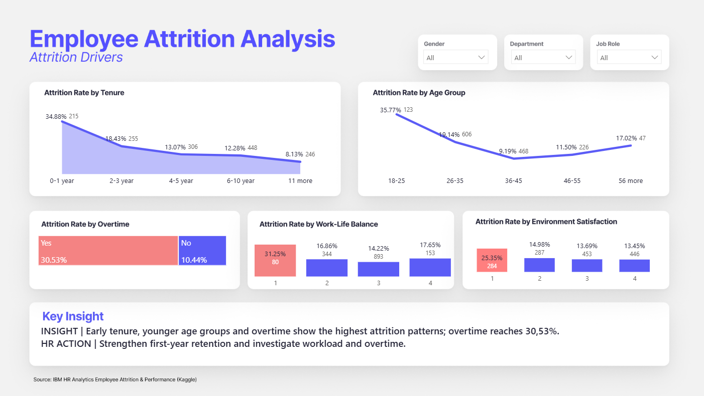
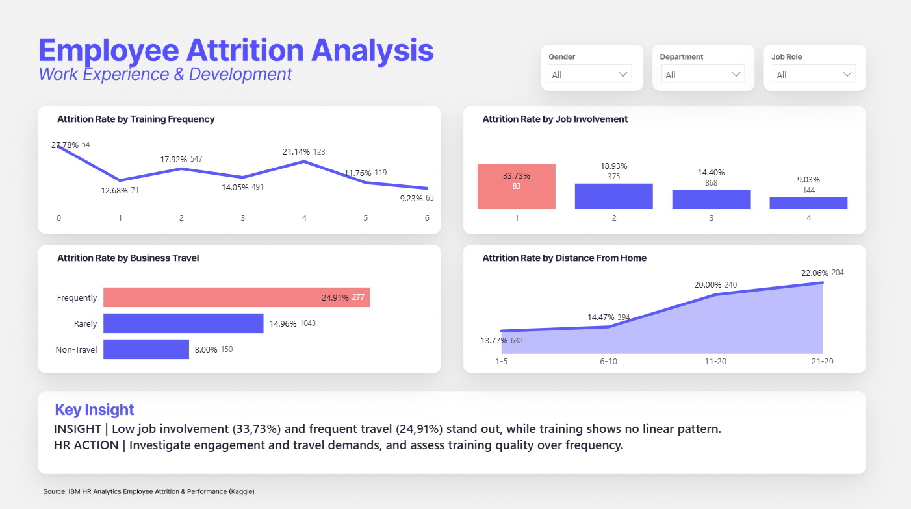

# HR Analytics | Employee Attrition Analysis

🇺🇸 **English** | [🇧🇷 Português](README-PTBR.md)

**Power BI • Power Query • DAX • People Analytics • Data Visualization • Data Storytelling**

📊 **Dashboard:** [Download the file to explore the interactive report in Power BI Desktop.](dashboard/PeopleAnalyticsEmployeeAttrition.pbix)

> A People Analytics case study built in Power BI to explore employee
> attrition patterns, identify workforce groups with higher attrition
> rates, and translate data into actionable HR questions.

## Project Overview

Employee attrition can affect organizational knowledge, productivity,
workforce planning, recruitment costs, and team stability. This project
was developed as a People Analytics portfolio case to investigate **who
is leaving, which workplace characteristics are associated with higher
attrition, and where HR could prioritize deeper investigation**.

The analysis is descriptive and exploratory. It identifies associations
in the dataset, but it does **not** claim that any individual factor
causes employee attrition.

### Main objectives

-   Measure the overall employee attrition rate.
-   Identify departments and job roles with higher attrition.
-   Explore employee profile and tenure patterns.
-   Analyze workplace factors such as overtime, work-life balance,
    environment satisfaction, job involvement, business travel,
    commuting distance, and training.
-   Build an interactive Power BI dashboard with dynamic filters and
    narrative insights.
-   Translate analytical findings into practical HR investigation areas.

## Business Questions

1.  What is the overall attrition rate?
2.  Which departments and job roles show the highest attrition rates?
3.  Is overtime associated with higher attrition?
4.  At what stage of employee tenure is attrition highest?
5.  Which age groups show higher attrition?
6.  How do work-life balance and environment satisfaction relate to
    attrition?
7.  How does job involvement vary with attrition?
8.  Is business travel associated with different attrition rates?
9.  Does distance from home show a meaningful pattern?
10. What can be observed about training frequency and attrition?

## Dataset

**Dataset:** IBM HR Analytics Employee Attrition & Performance\
**Source:** Kaggle\
**Dataset page:**
https://www.kaggle.com/datasets/pavansubhasht/ibm-hr-analytics-attrition-dataset\
**Original creator:** IBM data scientists\
**Nature:** Fictional / synthetic HR dataset\
**Original size:** 1,470 employee records and 35 variables

The dataset includes employee demographics, job characteristics,
compensation, satisfaction indicators, work conditions, experience,
training, tenure, and an `Attrition` field indicating whether the
employee left.

> Because the dataset is fictional, the results should be interpreted as
> a portfolio case study rather than findings about a real organization.

## Data Preparation

Data preparation was performed in **Power Query** before building the
analytical model.

### Data quality checks

-   Confirmed **1,470 employee records**.
-   Used `EmployeeNumber` as the unique employee identifier.
-   Validated the `Attrition` field:
    -   `No`: 1,233 employees
    -   `Yes`: 237 employees
-   Reviewed column quality, distribution, data types, null values, and
    errors.
-   Reviewed numerical ranges and categorical scales before analysis.

### Columns removed from the analytical view

The following fields were removed because they were constant across all
records or were not useful for the selected analysis:

-   `EmployeeCount`
-   `Over18`
-   `StandardHours`
-   `DailyRate`
-   `HourlyRate`
-   `MonthlyRate`

### New analytical groups

To improve readability and reduce noisy category-level comparisons,
additional groups were created:

**Age Group** - 18--25 - 26--35 - 36--45 - 46--55 - 56+

**Tenure Group** - 0--1 year - 2--3 years - 4--5 years - 6--10 years -
11+ years

**Distance Group** - 1--5 - 6--10 - 11--20 - 21--29

## Data Modeling & DAX

Core measures were created in DAX so that KPIs, charts, and narrative
insights respond dynamically to report filters.

``` dax
Total Employees =
DISTINCTCOUNT('Planilha1'[EmployeeNumber])
```

``` dax
Employees_Left =
CALCULATE(
    [Total Employees],
    'Planilha1'[Attrition] = "Yes"
)
```

``` dax
Attrition_Rate =
DIVIDE(
    [Employees_Left],
    [Total Employees],
    0
)
```

Additional measures were created for average age, average monthly
income, and **dynamic narrative insights**. The narrative measures
recalculate as users filter the report by Gender, Department, or Job
Role.

## Dashboard Structure

The report contains three analytical pages.

### 1. Executive Overview

**Purpose:** Provide a high-level view of workforce attrition and
identify where attrition is most concentrated.



Main components: - Total Employees - Employees Left - Attrition Rate -
Average Age - Average Monthly Income - Attrition Rate by Department -
Attrition Rate by Job Role - Attrition Rate by Gender - Dynamic Key
Insight

**Main finding:** The overall attrition rate is **16.12% (237
employees)**. Sales has the highest departmental attrition rate at
**20.63%**, while **Sales Representative** has the highest job-role
attrition rate at **39.76%**.

### 2. Attrition Drivers

**Purpose:** Explore employee characteristics and workplace conditions
associated with higher attrition.


Analyses: - Tenure - Age Group - Overtime - Work-Life Balance -
Environment Satisfaction

Key results: - Employees with **0--1 year of tenure:** **34.88%** -
Employees aged **18--25:** **35.77%** - Overtime = Yes: **30.53%** -
Overtime = No: **10.44%** - Work-Life Balance level 1: **31.25%** -
Environment Satisfaction level 1: **25.35%**

An additional exploratory cross-check showed that **71.5% of employees
aged 18--25 have three years of tenure or less**. This indicates that
age and tenure overlap and should not automatically be interpreted as
independent drivers.

### 3. Work Experience & Development

**Purpose:** Explore how work experience, engagement, travel, commuting
distance, and development relate to attrition.



Analyses: - Training Frequency - Job Involvement - Business Travel -
Distance From Home

Key results: - Job Involvement level 1: **33.73%** - Job Involvement
level 4: **9.03%** - Frequent business travel: **24.91%** - Non-travel:
**8.00%** - Distance 1--5: **13.77%** - Distance 21--29: approximately
**22%** - No training in the previous year: **27.78%**

Training frequency does **not** show a consistent linear relationship
with attrition. Employees with no training have the highest
training-related attrition rate, but rates fluctuate across the other
training-frequency groups. Therefore, the analysis does not support the
claim that simply increasing training frequency would reduce attrition.

## Key Insights

### 1. Attrition is concentrated in specific workforce groups

The company-wide attrition rate is **16.12%**, but the rate varies
substantially by role. Sales Representative reaches **39.76%**, making
it the most prominent job-role group in the analysis.

### 2. Overtime is strongly associated with attrition

Employees working overtime show an attrition rate of **30.53%**,
compared with **10.44%** among employees who do not work overtime.

This is one of the largest contrasts observed in the dashboard and
suggests that workload and working patterns deserve deeper
investigation.

### 3. The beginning of the employee journey is a critical retention period

Employees with **0--1 year at the company** show **34.88% attrition**,
compared with **8.13%** among employees with 11+ years.

This suggests that onboarding, expectation alignment, early leadership
support, and first-year employee experience may be valuable areas for HR
to investigate.

### 4. Younger employees show higher attrition, but age overlaps with tenure

Employees aged **18--25** show a **35.77% attrition rate**. However,
71.5% of this age group has three years of tenure or less.

This overlap means the dashboard should not be used to conclude that age
itself is responsible for attrition.

### 5. Work experience indicators show meaningful differences

Low Job Involvement is associated with substantially higher attrition
(**33.73%**) than high Job Involvement (**9.03%**).

Employees who travel frequently also show higher attrition (**24.91%**)
than employees who do not travel (**8.00%**).

Employees living farther from work show higher attrition in the grouped
analysis, reaching approximately **22%** in the 21--29 distance group.

### 6. Training requires a more nuanced interpretation

Employees with no training in the last year show **27.78% attrition**,
but training frequency and attrition do not follow a linear pattern.

The result supports further investigation into training access,
relevance, employee profile, and development opportunities rather than a
simple "more training = lower attrition" conclusion.

## From Data to HR Action

The dashboard is intended to guide **questions and prioritization**, not
prescribe actions based on correlation alone.

Potential HR investigation areas include:

-   **Early-tenure retention:** Review onboarding, first-year
    checkpoints, expectation alignment, and manager support.
-   **Sales Representative experience:** Investigate workload, targets,
    role expectations, leadership practices, compensation structure, and
    career experience within the role.
-   **Overtime:** Analyze frequency, workload distribution, staffing
    capacity, and whether overtime is concentrated in particular teams
    or roles.
-   **Job involvement:** Use qualitative research, pulse surveys,
    manager conversations, and employee listening to understand what may
    be affecting engagement.
-   **Business travel:** Explore travel intensity, recovery time,
    flexibility, and employee experience among frequent travelers.
-   **Commuting distance:** Investigate whether flexibility, hybrid
    work, transportation support, or location-specific practices could
    affect employee experience.
-   **Training:** Evaluate training access, quality, relevance,
    completion, and application rather than measuring only training
    frequency.

## Analytical Decisions & Exploratory Findings

Not every exploratory analysis was included in the final dashboard.

For example, employees who left initially appeared to have a lower
average monthly income than employees who stayed. However, when the
comparison was performed within the same job role (Sales
Representative), the income gap became substantially smaller.

This suggested that **job-role composition may explain part of the
overall income difference**, so salary was not presented as a standalone
attrition driver in the final dashboard.

Similarly, variables such as Years Since Last Promotion were not
prioritized because tenure and age patterns could heavily influence
their interpretation.

## Limitations

-   The dataset is **fictional**, not organizational production data.
-   The analysis is descriptive and observational; **association does
    not imply causation**.
-   There is no event-level historical timeline for analyzing attrition
    trends over months or years.
-   The dataset does not provide detailed reasons for employee exits.
-   Age, tenure, job role, income, and other variables can be correlated
    with one another.
-   A multivariate statistical analysis would be required to estimate
    the independent contribution of each factor.
-   The dashboard should therefore be used to identify **areas for
    further investigation**, not to make deterministic predictions about
    individual employees.

## Tools & Skills

-   **Power BI** --- dashboard development and interactive analysis
-   **Power Query** --- data cleaning and transformation
-   **DAX** --- measures, KPIs, filter-aware calculations, and dynamic
    narrative insights
-   **Figma** --- dashboard interface and visual layout
-   **People Analytics** --- HR metric interpretation and business
    framing
-   **Data Visualization** --- chart selection, hierarchy, and visual
    storytelling
-   **Data Storytelling** --- translating analysis into HR-relevant
    insights

## Design Approach

The dashboard uses a consistent visual system across all three pages:

-   Clean corporate layout
-   Indigo as the primary analytical color
-   Coral for selected high-attention groups
-   Neutral background and typography
-   Multiple chart types selected according to the nature of each
    variable
-   Native Power BI visuals to avoid paid/custom visual dependencies
-   Consistent slicers for Gender, Department, and Job Role

The design was prototyped in **Figma** and implemented in **Power BI**.

## Repository Structure

A suggested repository structure is:

``` text
HR-Analytics-Employee-Attrition/
│
├── README.md
│
├── dashboard/
│   └── HR_Employee_Attrition.pbix
│
├── images/
│   ├── executive-overview.png
│   ├── attrition-drivers.png
│   └── work-experience-development.png
│
└── data/
    └── README.md
```

The `data/README.md` can contain the dataset source and instructions for
obtaining the original dataset rather than redistributing the source
file.

## Next Steps

Possible extensions for this project include:

-   Build a multivariate attrition model to control for overlapping
    employee characteristics.
-   Analyze interaction effects such as Job Role × Overtime.
-   Develop a dedicated early-tenure retention view.
-   Add benchmarking or historical trend analysis if time-based data
    becomes available.
-   Incorporate qualitative employee-listening data to complement the
    quantitative findings.

------------------------------------------------------------------------

## About This Project

This project was developed as a **People Analytics portfolio case
study** to demonstrate the complete analytical workflow: business
framing, data preparation, exploratory analysis, DAX modeling, dashboard
design, data storytelling, and translation of findings into HR
investigation areas.
